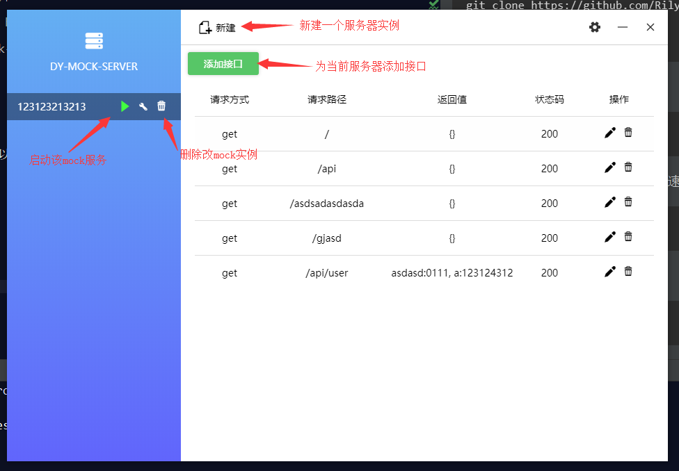

# dy-mock-server

用于前端调试接口的客户端server软件。

### 使用步骤

1.克隆该仓库
```
git clone https://github.com/RilyZhang/dy-mock-server

cd dy-mock-server
```

2.安装依赖
```
npm i
```

中国区域可以使用cnpm来提高安装速度

```
cnpm i
```

3.启动
```
npm start
```

<br>

